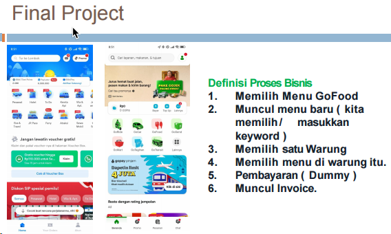

# 🙋🏻‍♂️📱Introduction to Mobile Programming Course
In the early classes, I'll cover various topics about mobile programming, how the class will flow, and the tools we'll use, etc.
## ✨Grading
|Komponen Nilai|Bobot|
|---|---|
|Tugas & Praktikum|40%|
|Ujian Tengah Semester|30%|
|Final Project|40%|


## 🎓Final Project Requirements
- Individu
1. `n` anggota x 1 proses bisnis
2. `1` proses bisnis minimal `4 activity`
3. *Adaptive layout*

- Kelompok
1. Using Firebase(database, fireStore, authentication, etc)
2. Homepage & fragment
3. Share preference & Settings(3 minimum variables)



## 😩Next Week Assignment
Try to make a mobile mockup
> You can use any tools, but i recommend using Figma.
> These mockup will be used as a reference for the final project

## 📱Mobile Programming 
Mobile programming is developing mobile applications for smartphones and tablets. The two main platforms for mobile programming are iOS and Android. Other platforms include Windows Mobile, Symbian, and BlackBerry.

### 🍎iOS Platform
iOS is a mobile operating system created and developed by Apple Inc. exclusively for its hardware. It is the operating system that powers many of the company's mobile devices, including the iPhone and iPod Touch; it also powered the iPad until the introduction of iPadOS in 2019.

Objective-C and Cocoa framework are used to develop iOS applications on iPhone and iPad. To develop an iOS applications you'll need a Mac OS X computer and XCode.

### 🤖Android Platform
Android is a mobile operating system based on a modified version of the Linux kernel and other open source software, designed primarily for touchscreen mobile devices such as smartphones and tablets. Android is developed by a consortium of developers known as the Open Handset Alliance and commercially sponsored by Google.
Using Java and Android SDK, you can develop Android applications on Android phones and tablets. You can also use Kotlin, a new programming language developed by JetBrains and supported by Google.

IDE for Android development is Android Studio, which is based on IntelliJ IDEA. The other IDEs are Eclipse and NetBeans.

### 🧑🏻‍🔬Mobile vs. Web vs. Desktop
|Mobile|Web Applications|Desktop Application|
|---|---|---|
|Mobile applications are developed for smartphones and tablets.|Web applications are developed for web browsers.|Desktop applications are developed for desktops and laptops.|
|Mobile applications are developed using iOS and Android platforms.|Web applications are developed using HTML, CSS, and JavaScript.|Desktop applications are developed using Java, C++, and C#.|
|Mobile applications are installed from the app store.|Web applications are accessed through the internet.|Desktop applications are installed from the internet or from a CD.|
|Example: Facebook, Instagram, and WhatsApp.|Example: Google, Amazon, and Facebook.|Example: Microsoft Office, Adobe Photoshop, and VLC Media Player.|

## 🛠️Framework
Framework is a platform for developing software applications. It provides a foundation on which software developers can build programs for a specific platform. A framework may include predefined classes and functions that can be used to process input, manage hardware devices, and interact with system software. 

Framework is built to make developers life easier by providing a set of tools and libraries that can be used to develop software applications. It is designed to simplify the programming process by allowing developers to write less code to accomplish specific tasks.

## 📱🛠️Mobile app type framework
- **Native Framework**: Native frameworks are designed to develop applications for a specific platform. For example, iOS applications are developed using the iOS SDK, which includes XCode, Objective-C, and Cocoa Touch. Android applications are developed using the Android SDK, which includes Android Studio, Java, and Android API. Applications utilize `RAM`, `CPU`, `Camera`, etc. to run the application.
- **Web Apps**: Software app distributes through `web` using browser and web technologies. It's not a native app, but it's a web app that can be accessed through a browser.
- **Hybrid Apps**: Hybrid apps are a combination of native and web apps. They are developed using web technologies such as HTML, CSS, and JavaScript, and then wrapped in a native application using platforms like Cordova, PhoneGap, etc. It's a web app that runs in a native app.

### 📱Native Framework
A good quality app in terms of performance, user experience, and security can be developed using native frameworks. It is the best choice for developing applications that require high performance, such as games, video editing, and other resource-intensive applications. But Native apps are expensive to develop and maintain.

Therefore, to achieve many user target in diverse platform and reduce development cost, developers use `cross-platform` frameworks.

### 🔟Top Mobile Framework in 2024
1. React Native
2. Flutter
3. Xamarin
4. Swiftic
5. Ionic
6. Apache Cordova
7. jQuery Mobile
8. NativeScript
9. Sencha Ext JS
10. Onsen UI

## What's Flutter🤔⁉️
Flutter is an open-source UI software development kit created by Google. It is used to develop applications for Android, iOS, Linux, Mac, Windows, Google Fuchsia, and the web from a single codebase. The first version of Flutter was known as codename "Sky" and ran on the Android operating system.

Flutter is developed using Dart, a modern, object-oriented language known for its simplicity and ease of learning. Dart is designed to be beginner-friendly while also offering powerful features for building robust applications. It's considered a client-optimized language, making it ideal for creating fast and efficient apps across various platforms. One of Dart's strengths is its ability to compile to multiple architectures, including ARM and JavaScript, enabling developers to deploy their applications to a wide range of devices and platforms.

### 🧩Widget and Element concept on Flutter
Widget is concept where UI can be considered as `Lego Blocks`, which is a new figure that can be combined with other blocks to create a new figure. In Flutter, everything is a widget. Widgets are the building blocks of the Flutter UI, and each widget is an immutable declaration of part of the user interface. Unlike other frameworks that use separate views and view controllers, Flutter uses widgets that are both views and view controllers.

## 📦Installation Requirement
### 🐱‍💻Git
Git is a distributed version control system for tracking changes in source code during software development. It is designed for coordinating work among programmers, but it can be used to track changes in any set of files. Its goals include speed, data integrity, and support for distributed, non-linear workflows.
You can install it on [Git](https://git-scm.com/)
> To acquainted with git, you can follow this [tutorial](https://www.petanikode.com/git-untuk-pemula/)

Verify Installation git using 
```bash
git --version
```
The result should be like this


You can configure your email and username using
```bash
git config --global user.name "your username"
git config --global user.email "email@email.com"
```
> Ensure that your `username` and `email` on your local machine match those of your GitHub account. And don't forget to remove the `""` symbol.

### 🛠️💻VSCode Installation and Flutter Extension
Install VSCode from this [link](https://code.visualstudio.com/download) and don't forget to install Flutter extension 


### 🧩Flutter SDK Installations
Download and Extract [SDK](https://docs.flutter.dev/get-started/install), choose the operating system platform that matches yours.
> Avoid extracting to `C:\Program Files\` directory, as it requires administrative access.

Instead, create `src` folder in `C:` and then use this bash command
```bash
git clone https://github.com/flutter/flutter.git -b stable
```
Update your Windows PATH to `C:\src\flutter\bin`

### 🤖Android Studio and SDK
Download and install the latest version of Android Studio through this [link](https://developer.android.com/studio), afterward run `Android Studio Setup wizard`. It'll install 
1. Latest Android SDK
2. Android SDK Command-line Tools
3. Android SDK Build Tools

Don't forget to update Android SDK by installing `Android Command Line Tools` by following this 


Next step we run this in terminal and enter `y`
```bash
flutter doctor -–android-licenses
```

After completing several installations🤯, run 
```bash
flutter doctor
```
to ensure that the installation process ran smoothly.


Aaannnd Well Done🥳🙌🏻, you've completed the installation process. Now you can start to create your first flutter project.


