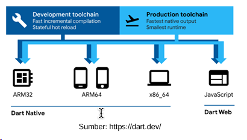
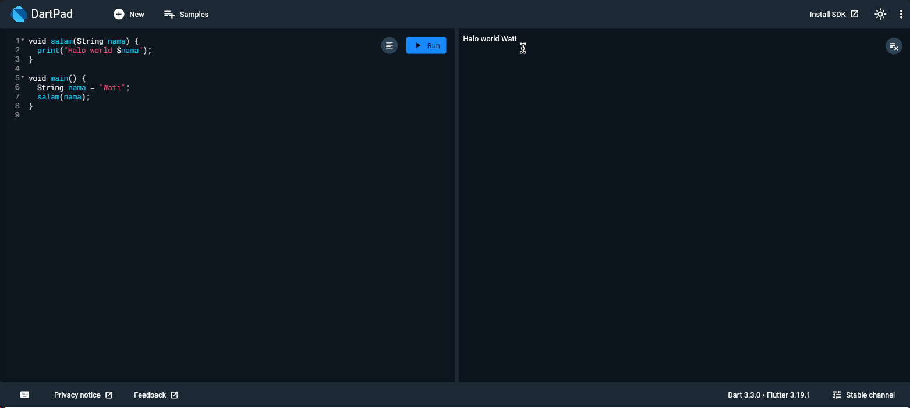
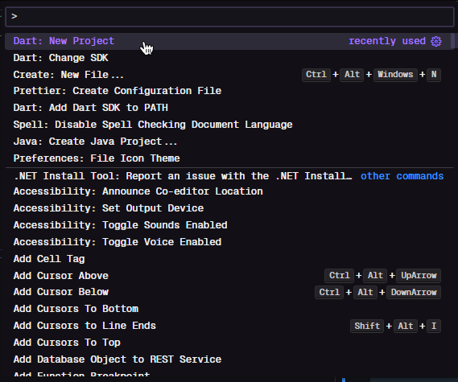
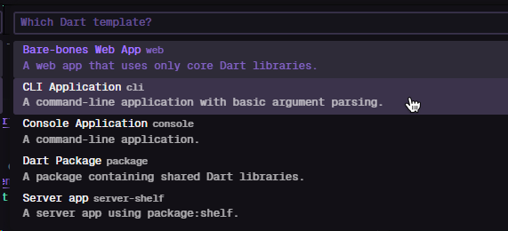
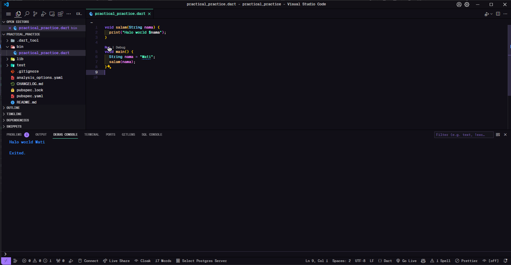

# 🎯Introduction to Dart and Flutter

Welcome to the third module of the course `Mobile Programming`. In this module, we will learn about Dart and Flutter🎯.
This session we'll learn about basic Dart.

- [📚Introduction to Dart](#31----introduction-to-dart)
- [🏃🏻‍♂️Running Dart](#32----running-dart)
  - [Online](#online)
  - [Using VSCode](#using-vscode)
- [➡️Control Flow](#33----control-flow)
  - [If-Else](#if-else)
  - [Loop: For and While](#loop-for-and-while)
- [🔄Data Type](#34----data-type)
  - [Var and Dynamic Type](#var-and-dynamic-type)
  - [Conversion Between Type](#conversion-between-type)
  - [List](#list)
  - [Map](#map)
  - [Generic](#generic)
  - [Map() and Where()](#map-and-where)
  - [Spread Operator](#spread-operator)
  - [Collection if and Collection for](#collection-if-and-collection-for)
  - [Const and Final](#const-and-final)
  - [Enum](#enum)
  - [Null Safety](#null-safety)
- [🎮Function and Method](#35----function-and-method)
- [🔄Others](#36----others)
  - [Arrow Syntax](#arrow-syntax)
  - [Conditional Ternary Operator](#conditional-ternary-operator)
  - [Practical Work](#practical-work)

## 🖇️Quick Links

- [📚Module](3.%20Modul%20Praktikum%20Pengantar%20Dart%20bagian%201.pdf)
- [🔢Practical Code](../03-dart-flutter/practical_code/)
- [🤓Practical Practice](../03-dart-flutter/practical_practice/)

## 3.1 - 🎯 Introduction to Dart

So basically Dart was a code programme developed by Google which is in the beginning of development to replace JavaScript. Dart is the main component of Flutter, a mobile app SDK. Dart has a lot of features that make it a great language for writing mobile, desktop, server, and web applications.

Some characteristic of Dart:

1. Dart is `multiplatform`
2. For `UI` Production
3. `Similar to Java` and C++ with some simplification which making easier to learn
4. `High Performance`. Dart using JIT(Just In Time) and AOT(Ahead Of Time) compilation. JIT is used when developing an app for programmer, optimized for feedback while development and debug. While AOT optimized for end-user coz produce small sizes of code and optimal runtime. very few code language uses JIT and AOT simultaneously.
5. `Null Safety` preventing null point error happen while runtime coz prevent while compile time.
6. Strong Type but `support dynamic type`

Here's Dart Cycle:



## 3.2 - 🏃🏻‍♂️ Running Dart

Dart can be ran online or offline

### Online

Using <https://dartpad.dev/>
Here's some example and run sample :

```dart
void salam(String nama) {
  print("Halo world $nama");
}

void main() {
  String nama = "Wati";
  salam(nama);
}
```



### Using VSCode

- Make sure you're already finishing set up on the [previous module](../01-intro-to-mobile/README.md#🛠️💻vscode-installation-and-flutter-extension)
- `CTRL+SHIFT+P` and type `Dart: New Project`
  
- and choose console application
  
- When we run previously code
  

## 3.3 - 🎮 Control Flow

### If-Else

```dart
void main() {
  int a = 10;
  int b = 20;

  if (a > b) {
    print("a lebih besar dari b");
  } else if (a < b) {
    print("a lebih kecil dari b");
  } else {
    print("a sama dengan b");
  }
}
```

### Loop: For and While

- For

```dart
void main() {
  for (int i = 0; i < 5; i++) {
    print("Perulangan ke-$i");
  }
}
```

- While

```dart
void main() {
  int i = 0;
  while (i < 5) {
    print("Perulangan ke-$i");
    i++;
  }
}
```

> [!TIP]
> Dart also support break and continue. Break is used to stop the loop and continue is used to skip the current iteration and continue to the next iteration.

- Break and continue

```dart
void main() {
  for (int i = 0; i < 5; i++) {
    if (i == 1) {
      continue;
    } else if (i == 4) {
      break;
    }
    print(i);
  }
}
```

## 3.4 - 🔄 Data Type

By default all Dart variable must be declared the type first(type safe). Code will be error if we declare the variable without type and without value.

```dart
void main() {
  String nama = "Wati";
  nama = 42; //string type cannot be assigned to int type
  print("nama $nama");
}
```

> [!IMPORTANT]
> Catch error as you can before compiling coz error while runtime is probably causing more bigger lose

Standard type for dart is

- Int
- Double
- String
- Boolean
- List
- Map
- Symbol

```dart
void main() {
  int angka = 10;
  double angkaDesimal = 10.5;
  String nama = "Wati";
  bool isTrue = true;
  List<int> listAngka = [1, 2, 3, 4, 5];
  Map<String, int> mapAngka = {"satu": 1, "dua": 2, "tiga": 3};
  Symbol simbol = #simbol;

  print("$angka; $angkaDesimal; $nama; $isTrue; $listAngka; $mapAngka; $simbol");
}
```

### Var and Dynamic Type

Dart also provide flexible variable type which was `var` and `dynamic`.

- Var

Var are making a new data type based on the value of the variable. But after the variable is declared, the data type cannot be changed. Like this code:

```dart
void main() {
  var nama = "Wati";
  nama = 42; //string type cannot be assigned to int type
  print("nama $nama");
}
```

- Dynamic

Dynamic is a type that can be changed at any time. Like this code:

```dart
void main() {
  dynamic nama = "Wati";
  nama = 42; //string type cannot be assigned to int type
  print("nama $nama");
}
```

> [!TIP]
> Var type are going become Dynamic if it's not declared at first. But this not recommended and will shows a warning

```dart
void main() {
  var nama;
  nama = "Wati";
  nama = 42; //it's okay
  print("nama $nama");
}
```

### Conversion Between Type

We can use parse() to converse a string type to integer or double

```dart
void main() {
  String str = '12';
  String str2 = '14.24';
  int num = int.parse(str);
  double num2 = double.parse(str2);
  print(num); // Output: 12
  print(num2); // Output: 14.24
}
```

### List

List is a collection of ordered elements. It's like Java's array which used to save dynamic array. The elements can be of different types. The list can be declared using the List keyword or using square brackets.

```dart
void main() {
  List<int> listAngka = [1, 2, 3, 4, 5];
  List<String> listNama = ["Wati", "Budi", "Joko"];
  List<dynamic> listCampuran = [1, "Wati", 3.14, true];
  print(listAngka);
  print(listNama);
  print(listCampuran);
}
```

### Map

Map type is used to save key-value pairs. The key and value can be of any type. The key is unique, but the value can be repeated. The map can be declared using the Map keyword or using curly brackets.

```dart
Map<String, int> umur ={
  'Budi': 20,
  'Andi': 21,
  'Caca': 22
};

void main(){
  umur['Budi'] = 25;
  umur['Iwan'] =21;
  print(umur['Budi']);
  print(umur);
}
```

- or we can use loop to get key value using `for-each`

```dart
void main(){
  umur.forEach((key, value) {
    print("$key : $value");
  });
}
```

or

```dart
void main() {
  umur.forEach((nama, u) => print('$nama berumur $u tahun'));
}
```

- using loop key

```dart
void main() {
  for (String nama in umur.keys) {
    print(nama);
    print(umur[nama]);
  }
}
```

### Generic

Generic makes class, function, method using various kind type(type become a parameter) but still using compile type safety like java.

```dart
List myIntList = [];

void main() {
  myIntList.add(1);
  myIntList.add("xx"); //still can be ran
  print(myIntList);
}
```

but when we add generic `<int>` it will be error

```dart
List<int> myIntList = [];

void main() {
  myIntList.add(1);
  myIntList.add("xx"); //error
  print(myIntList);
}
```

Just like maps, lists can be declared dynamically using the _`List<dynamic>`_ notation, allowing for the addition of any data type to the list. Similarly, maps are also declared with dynamic data types by default, denoted as _`Map<dynamic, dynamic>`_.

### Map() and Where()

Used when we want to filter the list

```dart
void main() {
  List<int> listAngka = [1, 2, 3, 4, 5];
  List<int> listGenap = listAngka.map((e) => e * 2).toList();
  List<int> listGanjil = listAngka.where((e) => e % 2 != 0).toList();
  print(listGenap);
  print(listGanjil);
}
```

another shot

```dart
void main() {
  List<int> numbers = [1, 2, 3, 4, 5];
  List<int> squaredEvens =
      numbers.where((int x) => x % 2 == 0).map((int x) => x * x).toList();
  print(squaredEvens);
}
```

### Spread Operator

List can be added to another list regularly using spread operator which was `...`

```dart
void main() {
  List<int> list1 = [1, 2, 3];
  List<int> list2 = [4, 5, 6];
  List<int> list3 = [...list1, ...list2];
  List? list4;
  List<int> list5 = [1, ...?list4];
  print(list3); // 1,2,3,4,5,6
  print(list4); //null
  print(list5); // 1 only
}
```

### Collection if and Collection for

Useful when we want to create a list or map based on existed list before.

- Collection if

```dart
void main() {
  int x = 15;
  List x1 = [1, if (x > 10) 100 else -1, 500];
  print(x1);
}
```

> [!TIP]
> Collection if dapat digantikan dengan ternary operator List x1 = [1, x > 10? 100:-1, 500];

- Collection for

```dart
void main() {
  List<int> list = [1, 2, 3, 4, 5];
  List<int> list2 = [for (var i in list) i * 2];
  print(list2);
}
```

- If and For Collection Combination

```dart
void main() {
  List<int> list = [1, 2, 3, 4, 5];
  List<int> list2 = [
    for (var i in list)
      if (i % 2 == 0) i * 2 else i
  ];
  print(list2); // 1, 4, 3, 8, 5
}
```

More complex example:

```dart
void main() {
  List<Map<String, dynamic>> data = [
    {'nama': 'Budi', 'hari lembur': 4, 'gaji': 10},
    {'nama': 'Andi', 'hari lembur': 2, 'gaji': 20},
    {'nama': 'Caca', 'hari lembur': 7, 'gaji': 50}
  ];

  print(data);

  List<Map<String, dynamic>> pendapatan = [
    for (Map<String, dynamic> p in data)
      {"nama": p['nama'], "pendapatan": p['hari lembur'] * 0.5 + p['gaji']}
  ];
  print(pendapatan);
}
```

```markdown
[{nama: Budi, hari lembur: 4, gaji: 10}, {nama: Andi, hari lembur: 2, gaji: 20}, {nama: Caca, hari lembur: 7, gaji: 50}]
[{nama: Budi, pendapatan: 12.0}, {nama: Andi, pendapatan: 21.0}, {nama: Caca, pendapatan: 53.5}]
```

### Const and Final

- In programming, a constant value declared with the `const` keyword must be initialized immediately and cannot be changed thereafter.

```dart
void main() {
  const int x = 10;
  x = 5; // it won't error coz const cannot be assigned
  print(x);
}
```

- Contrary to `const`, `final` allows you for initialization at a later time without the immediate requirement. However, once initialized, the value cannot be changed thereafter.

```dart
void main() {
  final int a;
  a = 5;
  a = 3; // it'll error coz it already final
  print(a);
}
```

### Enum

Enum used to represent a constant group

```dart
enum jenisMhs { mhsS1, mhsS2, mhsS3 }

void main() {
  jenisMhs jm = jenisMhs.mhsS1;
  print(jm);
}
```

To access `String` from `enum`, we can use .name.

```dart
enum jenisMhs { mhsS1, mhsS2, mhsS3 }

void main() {
  String jm = jenisMhs.mhsS1.name;
  print(jm);
}
```

To `map` result of `enum` to a list we can use values and then map

```dart
enum jenisMhs { mhsS1, mhsS2, mhsS3 }

void main() {
  List<String> namaJenisMahasiswa =
      jenisMhs.values.map((jenisMhs m) => m.name).toList();

  print(namaJenisMahasiswa);
}
```

### Null Safety

Null pointer errors often cause issues in applications. Dart introduces features to mitigate this problem, utilizing the `?`and `!` operators.

```dart
void main() {
  String? nama = null;
  print(nama?.length); //null
}
```

However, there's still a possibility of encountering errors during compilation.

```dart
void main() {
  int? x;
  print(x+2);
}
```

> [!IMPORTANT]
> To address this, the `!` operator can be used, although it's error-prone. It's advisable to avoid relying on this solution whenever possible.

```dart
void main() {
  int? x;
  print(x!+2);
}
```

The `??=` operator provides a way to assign a default value if the variable is null.

```dart
void main() {
  int? x;
  int y = x ??= 10 + 2;
  print(x);
}
```

## 3.5 - Function and Method

Always use simply object, it's better to use function and method to make the code more readable and maintainable. And it often used in flutter.

```dart
void salam(String nama) {
  print("Halo world $nama");
}

void main() {
  String nama = "Wati";
  salam(nama);
}
```

## 3.6 - Others

### Arrow Syntax

The arrow `=>` in Dart is utilized to streamline the body of functions or methods, with the right side denoting the return value.

```dart
String sayHello(String name) => "Hello " + name;

void main() {
  print(sayHello("Wati")); // Output: Hello Wati
}

```

In Flutter, nested anonymous functions are frequently used, where the arrow syntax plays a crucial role in improving code readability. Additionally, Dart supports passing functions as parameters, as demonstrated below:

```dart
void process(function) {
  print(function(2) + 50);
}

void main() {
  // Passing a function as a parameter
  process((x) => 100 * x); // Output: 250
  process((x) => 100 / x); // Output: 100
}
```

### Conditional Ternary Operator

The conditional ternary operator is a concise way to simplify if-else statements, commonly used in Flutter to streamline code. Its basic structure is `Condition ? TrueExpression : FalseExpression`. Here's a demonstration:

```dart
void main() {
  int x = 10;
  int y = 20;
  int result = x > y ? x : y;
  print(result); // Output: 20
}
```

Ternary operator useful when it combined with `Arrow Syntax`. Here's the example:

```dart
void main() {
  process((x) => x > 2 ? x * 10 : x * 2); // What's the result?
}

void process(function) {
  print(function(5) + 50);
}
```

Nested ternary operators can also be utilized effectively:

```dart
void main() {
  int age = 15;
  int salary = 60;
  String status;
  status = age >= 18 ? (salary >= 50 ? "Upper" : "Middle") : "Underage";
  print("Status: $status");
}
```

### Practical Work

#### Map and Where

1. The result of the following code is:

```dart
  List<int> l1 = [1, 2, 3];
  var l2 = l1.map((e) => 2 \* e).map((e) => "x$e");
```

2. Based on the example above, combine the uppercase transformation and selection process in one statement. After converting to uppercase, select only those containing "UD".

```dart
void main() {
  var listMhs = ["Wati", "Budi", "budi"];
  print("List 1:");
  print(listMhs);
  // buat list baru, yang isinya uppercase dari list lama
  print("List 2:");
  var listMhs2 = listMhs.map((mhs) => mhs.toUpperCase()).toList();
  print(listMhs2);
  // buat list baru yang isinya nama yang mengandung "ud"
  print("List 3:");
  var listMhs3 = listMhs.where((mhs) => mhs.contains("ud")).toList();
  print(listMhs3);
}
```

3. Create a map that transforms the elements of a list into their squares. For example, if the input is [1, 2, 3], the mapping result should be [1, 4, 9].

#### Collection if dan Collection for

1. The result of the following code is:

```dart
List<int> x1 = [1, 2, 3];
List x2 = [for (int x in x1) "x${x * 2}"];
```

2. Create a code that, based on the input list of strings, generates a list of string lengths.

```dart
List<String> s1 = ["satu", "dua", "sebelas"];

// List of the output
[4, 3, 7] // 'satu' panjangnya 'empat' etc
```

> [!TIP]
> Use str.length to get the length of the string

3. Create a list of squares of even elements from the input list.

```dart
input: [1,2,3,4,5,6];

output: [4, 16, 36]
```

> [!TIP] Use `%` operator to get the even number.

#### Arrow Syntax

1. What's the output of this code bellow?

```dart
  x.where((int x) => x % 2 == 0).map((int x) => x * x).toList();
```

#### Conditional Ternary Operator

1. What's the output of this code bellow?

```dart
  var x1 = [1, 2, 3];
  var x2 = x1.map((mhs) => mhs==2 ? -20 : mhs).toList();
  print(x2);
```

2. Based on this list, make a new list to calculate taxes `<10, the taxes is 15%; >=10, taxes is 20%`

```dart
List<Map<String, dynamic>> pegawai = [
  {"nama": "budi", "gaji": 5},
  {"nama": "wati", "gaji": 17},
];

// Output list
List<Map<String, dynamic>> pajak = [
  {"nama": "budi", "gaji": 5, "pajak": 0.15},
  {"nama": "wati", "gaji": 17, "pajak": 0.20},
];
```
