# 🪽Flutter

Welcome to the Flutter module! In this module, we will learn about Flutter, a popular open-source UI software development kit created by Google. Flutter is used to develop applications for Android, iOS, Linux, Mac, Windows, Google Fuchsia, and the web from a single codebase. It is a powerful framework that allows you to build beautiful and responsive user interfaces using a rich set of widgets and tools.

## 🚧 Table of contents:

- [4.1 - 🫚 Structure Flutter Project](#41----structure-flutter-project)
  - [📂 lib](#-lib)
  - [🤖 android & 🍎 ios](#-android--ios)
  - [📁 test](#-test)
  - [📄 pubspec.yaml](#-pubspecyaml)
  - [📂 assets](#-assets)
  - [📂 build](#-build)
  - [📄 README.md](#-readmemd)
  - [📄 .gitignore](#-gitignore)
  - [Example](#example)
- [4.2 - 🧩 Understanding Widgets in Flutter](#42---understanding-widgets-in-flutter)
  - [What are Widgets?](#what-are-widgets)
  - [Widget tree and how it works](#widget-tree-and-how-it-works)
- [4.3 - 👀 Types of Widgets](#43---types-of-widgets)
  - [StatelessWidget](#statelesswidget)
  - [StatefulWidget](#statefulwidget)
- [4.4 - 🌎 Simple Hello World App](#44---simple-hello-world-app)
- [4.5 - 🎨 Styling Widgets](#45---styling-widgets)
  - [TextStyle](#textstyle)
  - [BoxDecoration](#boxdecoration)
  - [ButtonStyle](#buttonstyle)
- [4.6 - 🔲 Layout Widgets](#46---layout-widgets)
  - [Column](#column)
  - [Row](#row)
  - [Stack](#stack)
  - [Expanded](#expanded)
- [4.7 - 📦 Container Widget](#47---container-widget)
  - [Properties](#properties)
  - [Example](#example-1)
- [4.8 - ⚙️ Built-in Widgets](#48---️-built-in-widgets)
  - [Image](#image)
  - [DropdownButton](#dropdownbutton)
  - [Button](#button)
    - [FloatingActionButton](#floatingactionbutton)
    - [IconButton](#iconbutton)
    - [ElevatedButton](#elevatedbutton)
    - [TextButton](#textbutton)
    - [SegmentedButton](#segmentedbutton)
    - [PopUpMenuButton](#popupmenubutton)
    - [CupertinoButton](#cupertinobutton)
- [4.9 - 🤏🏻 Selection Widgets](#49---selection-widgets)
  - [Checkbox](#checkbox)
  - [FilterChips](#filterchips)
  - [Radio](#radio)
  - [Switch](#switch)
  - [Sliders](#sliders)
- [4.10 - ❌ Form Validator](#410---form-validator)
- [4.11 - ℹ️ Snack Bar](#411---snack-bar)
- [4.12 - ⚠️ Alert Dialog](#412---alert-dialog)
- [4.13 - 💪🏻 Practice Sample](#413---practice-sample)
- [4.14 - 🪶 To-do](#414---to-do)
  - [SafeArea](#safearea)
  - [TextSpan](#textspan)
  - [Positioned](#positioned)
  - [Flexible](#flexible)
  - [isExpanded (DropDown)](#isexpanded-dropdown)
  - [SingleChildScrollView](#singlechildscrollview)
  - [Carousel](#carousel)
  - [with (keyword seperti interface)](#with-keyword-seperti-interface)
  - [passing data antar widget](#passing-data-antar-widget)
  - [Bottomsheet](#bottomsheet)
  - [Expansion Panel](#expansion-panel)
  - [CircleAvatar, Divider](#circleavatar-divider)

## 🖇️ Resource Link

Practicum Code : [📁 practical_code](../04-widget/practical_code)

Training Code : [📁🥷🏻 training_code](../04-widget/widget_practice/)

## 4.1 - 🫚 Structure Flutter Project

Flutter projects generally have a well-organized directory structure to separate application code, assets, and configuration. Here is a description of each directory and file that is commonly present in Flutter projects:

### 📂 lib

The `lib` directory is the main place to store the Flutter app code. In it, you will find the Dart files that are part of your application. The main files are usually:

- **main.dart**: This file is the entry point of your Flutter application. Here, you will find the `main()` function that starts the app and calls `runApp()` to display the main widget.

### 🤖 android & 🍎 ios

The `android` and `ios` directories contain platform-specific projects for Android and iOS. This includes the configuration for each platform, such as Gradle files for Android and Pod files for iOS. You rarely need to change these directories unless you need to customize platform-specific configurations.

### 📁 test

The `test` directory contains unit tests and widget tests for your application. This is the place where you can write and run tests to ensure that your code works correctly and doesn't break.

### 📄 pubspec.yaml

The `pubspec.yaml` file is the configuration file for your Flutter project. Here, you define all project dependencies, such as Flutter packages, third-party plugins, and assets that will be used in your application. You can also add project metadata, such as name, description, and version.

### 📂 assets

The `assets` directory contains all the assets used in your application, such as images, icons, font files, and more. You can store these assets here and refer to them from your code.

### 📂 build

The `build` directory will be created automatically when you run your Flutter project. It contains the output of the app-building process, including the files generated for the Android and iOS platforms.

### 📄 README.md

The `README.md` file is a markdown file that contains information about the project, such as how to run the app, how to contribute, and other relevant information.

### 📄 .gitignore

The `.gitignore` file is used to specify which files and directories should be ignored by Git. This is useful to avoid committing unnecessary files to your version control system.

### Example

```yaml
my_flutter_app/
│
├── android/
├── ios/
├── lib/
│ ├── main.dart
│ └── screens/
│ └── home_screen.dart
├── test/
│ └── widget_test.dart
├── assets/
│ └── images/
│ └── logo.png
└── pubspec.yaml
```

## 4.2 - 🧩 Understanding Widgets in Flutter

Widgets are the core building blocks of Flutter applications. They are the fundamental components that make up the user interface (UI) of your app. Flutter offers a wide range of widgets, both built-in and custom, that you can use to create beautiful and responsive UIs.

### What are Widgets?

In Flutter, everything is a widget. A widget is a single immutable description of a part of the UI. It describes what should be displayed on the screen, and it can also handle user interactions and respond to changes in data or state. Flutter provides a wide range of basic widgets that serve as the building blocks for creating user interfaces. Understanding these fundamental widgets is essential for developing Flutter applications effectively.

Widgets in Flutter are not just UI components; they can also be used to represent layout models, styling, and even application state. This allows you to create highly modular and reusable components that can be easily customized and composed together.

### Widget tree and how it works

Widgets are organized hierarchically in the form of a widget tree. Method build(BuildContext context) is called when the widget is to be inserted into the widget tree. Inside, there is a MaterialApp widget to wrap applications that use Material Design components. Inside it again we add a Scaffold to hold the AppBar widget (the bar at the top) and the Body. The Body is filled with the Center widget which finally contains the Text widget. You can see the hierarchical structure. From this simple example, comes the nickname in Flutter "Everything drawn on a screen is a widget".

## 4.3 - 👀 Types of Widgets

In Flutter, widgets are categorized into two main types: StatelessWidget and StatefulWidget. These types represent whether a widget is immutable or can change over time.

### StatelessWidget

A StatelessWidget is a widget that does not change its state after it has been built. It is immutable and does not have any internal state. This means that the appearance of a StatelessWidget is purely based on the input parameters it receives and does not change over time. Examples of StatelessWidget widgets include `Text`, `Icon`, `Image`, and `Container`.

### StatefulWidget

A StatefulWidget is a widget that can change its state over time. It is mutable and can be updated to reflect changes in data or user interactions. This allows StatefulWidget widgets to respond to changes and update their appearance dynamically. Examples of StatefulWidget widgets include `Checkbox`, `Slider`, `Switch`, and `TextField`.

## 4.4 - 🌎 Simple Hello World App

Here's a simple "Hello, World!" app in Flutter. This app displays a text message on the screen using the Text widget.

```dart
import 'package:flutter/material.dart';

void main() {
  runApp(MyApp());
}

class MyApp extends StatelessWidget {
  @override
  Widget build(BuildContext context) {
    return MaterialApp(
      home: Scaffold(
        appBar: AppBar(
          title: Text('Hello, World!'),
        ),
        body: Center(
          child: Text('Hello, World!'),
        ),
      ),
    );
  }
}
```

The `runApp` method in the `main()` function serves to inflate the MyApp widget (imagine a doll being formed when blown into) and "attach" it to the screen. The widget contains the description of the user interface, so it needs to be "blown into" and stuck onto the screen to become a visible component of the user interface that users can see and interact with. This technique is called `declarative UI`.

Next, the `MyApp` class extends `StatelessWidget`. As the names suggest, a StatelessWidget cannot be changed after it is created (static), while a StatefulWidget can be changed after it is created. Because this widget only displays "hello world" and then finishes, StatelessWidget is more appropriate to use.

### Hello World [Name]

The next one is a simple app that displays a greeting message with a name. The name is passed as a parameter to the `MyApp` widget. This is an example of how you can pass data to a widget and use it to customize the UI.

```dart
import 'package:flutter/material.dart';

void main()
{
  runApp(MyApp(name: 'John'));
}

class MyApp extends StatelessWidget {
  final String name;

  MyApp({required this.name});

  @override
  Widget build(BuildContext context) {
    return MaterialApp(
      home: Scaffold(
        appBar: AppBar(
          title: Text('Hello, $name!'),
        ),
        body: Center(
          child: Text('Hello, $name!'),
        ),
      ),
    );
  }
}
```

In this example, the `MyApp` widget takes a `name` parameter, which is used to customize the greeting message. The `name` parameter is passed to the widget when it is created and then used to display the greeting message in the app.

or take a look at [hello-world-nama.dart](../04-widget/practical_code/lib/3-hello-world-nama-padding.dart)

## 4.5 - 🎨 Styling Widgets

In Flutter, you can style widgets using the `style` property, which allows you to customize the appearance of the widget. You can set properties such as `color`, `fontSize`, `fontWeight`, `fontStyle`, `decoration`, and more to style the widget according to your design requirements.

### TextStyle

The `TextStyle` class is used to define the style of text in a `Text` widget. It allows you to set properties such as `fontSize`, `color`, `fontWeight`, `fontStyle`, `decoration`, and more to customize the appearance of the text.

```dart
Text(
  'Hello, World!',
  style: TextStyle(
    fontSize: 24,
    color: Colors.blue,
    fontWeight: FontWeight.bold,
    fontStyle: FontStyle.italic,
    decoration: TextDecoration.underline,
  ),
)
```

### BoxDecoration

The `BoxDecoration` class is used to define the appearance of a `Container` widget. It allows you to set properties such as `color`, `border`, `borderRadius`, `boxShadow`, and more to customize the appearance of the container.

```dart
Container(
  width: 100,
  height: 100,
  decoration: BoxDecoration(
    color: Colors.red,
    borderRadius: BorderRadius.circular(10),
    boxShadow: [
      BoxShadow(
        color: Colors.black,
        offset: Offset(2, 2),
        blurRadius: 5,
      ),
    ],
  ),
  child: Text('Hello, World!'),
)
```

### ButtonStyle

The `ButtonStyle` class is used to define the appearance of a button widget, such as `ElevatedButton` or `TextButton`. It allows you to set properties such as `textStyle`, `backgroundColor`, `padding`, `shape`, and more to customize the appearance of the button.

```dart
ElevatedButton(
  onPressed: () {},
  child: const Text('Login'),
  style: ElevatedButton.styleFrom(
    textStyle: const TextStyle(fontSize: 20),
    padding: const EdgeInsets.symmetric(horizontal: 50, vertical: 20),
    shape: RoundedRectangleBorder(
      borderRadius: BorderRadius.circular(20.0),
    ),
  ),
)
```

## 4.6 - 🔲 Layout Widgets

Flutter provides a variety of layout widgets that you can use to create complex and responsive user interfaces. These widgets allow you to arrange and position other widgets in a flexible and customizable way.

### Column

The `Column` widget is used to arrange its children in a vertical line. It is often used to create columns of widgets, such as lists, images, or input fields.

```dart
Column(
  children: [
    Text('First item'),
    Text('Second item'),
    Text('Third item'),
  ],
)
```

### Row

The `Row` widget is used to arrange its children in a horizontal line. It is often used to create rows of widgets, such as buttons, icons, or text fields.

```dart
Row(
  children: [
    Icon(Icons.star),
    Text('Hello, World!'),
  ],
)
```

### Stack

The `Stack` widget is used to position its children relative to the edges of the stack or relative to each other. It is often used to create complex layouts, such as overlapping elements or layered backgrounds.

```dart
Stack(
  children: [
    Container(color: Colors.red, width: 100, height: 100),
    Container(color: Colors.green, width: 75, height: 75),
    Container(color: Colors.blue, width: 50, height: 50),
  ],
)
```

### Expanded

The `Expanded` widget is used to expand a child of a `Row`, `Column`, or `Flex` widget to fill the available space. It is often used to create flexible layouts that adjust to the size of the screen or parent widget.

```dart
Row(
  children: [
    Expanded(
      child: Container(color: Colors.red, height: 100),
    ),
    Expanded(
      child: Container(color: Colors.green, height: 100),
    ),
    Expanded(
      child: Container(color: Colors.blue, height: 100),
    ),
  ],
)
```

## 4.7 - 📦 Container Widget

The `Container` widget is a versatile widget that can be used to create visual elements such as boxes, padding, margins, borders, and backgrounds. It is often used to lay out and style other widgets.

### Properties

The `Container` widget has several properties that allow you to customize its appearance and layout. Some of the most commonly used properties include:

- `color`: The background color of the container.
- `width`: The width of the container.
- `height`: The height of the container.
- `padding`: The padding around the child widget.
- `margin`: The margin around the container.
- `decoration`: The decoration of the container, such as border, borderRadius, and boxShadow.

### Example

Here's an example of how you can use the `Container` widget to create a simple box with padding, margin, and a border.

```dart
Container(
  width: 200,
  height: 200,
  padding: EdgeInsets.all(16),
  margin: EdgeInsets.all(16),
  decoration: BoxDecoration(
    color: Colors.blue,
    border: Border.all(color: Colors.black, width: 2),
    borderRadius: BorderRadius.circular(10),
  ),
  child: Text('Hello, World!'),
)
```

In this example, the `Container` widget is used to create a blue box with padding, margin, and a border. The `width` and `height` properties are used to set the size of the box, the `padding` and `margin` properties are used to add space around the box, and the `decoration` property is used to customize the appearance of the box.

## 4.8 - ⚙️ Built-in Widgets

Flutter provides a wide range of built-in widgets that you can use to create beautiful and responsive user interfaces. These widgets include basic UI components, such as text, images, buttons, and input fields, as well as more complex components, such as lists, grids, and navigation elements.

### Image

The `Image` widget is used to display images in a Flutter app. It supports various image sources, such as assets, files, and network URLs.

```dart
Image.asset('assets/logo.png')
Image.file(File('path/to/image.jpg'))
Image.network('https://example.com/image.jpg')
```

### DropdownButton

As an example, the `DropdownButton` widget is used to create a dropdown menu with a list of items. It allows users to select an item from the list and displays the selected item as the current value.

```dart
DropdownButton<String>(
  value: selectedValue,
  items: [
    DropdownMenuItem(value: 'Option 1', child: Text('Option 1')),
    DropdownMenuItem(value: 'Option 2', child: Text('Option 2')),
    DropdownMenuItem(value: 'Option 3', child: Text('Option 3')),
  ],
  onChanged: (value) {
    setState(() {
      selectedValue = value;
    });
  },
)
```

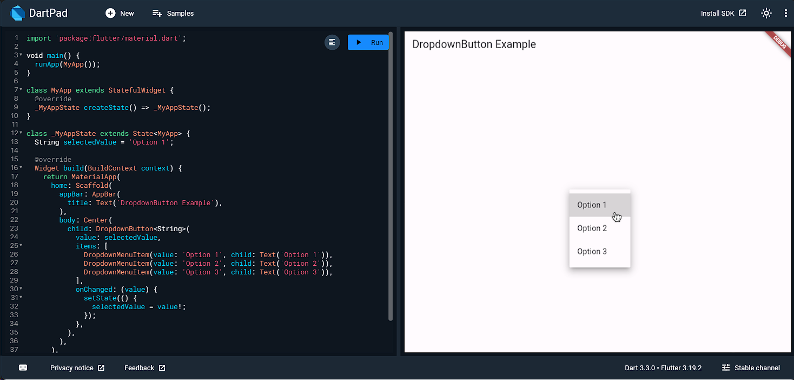

### Button

- `FloatingActionButton`: A circular button that floats above the content to promote a primary action in the application.
- `IconButton`: A button that displays an icon and triggers an action when pressed.
- `ElevatedButton`: A button with a raised appearance that displays an ink splash when pressed.
- `TextButton`: A button with a text label that displays an ink splash when pressed.
- `SegmentedButton`: A group of buttons that allows users to select one option from a set of mutually exclusive options.
- `PopUpMenuButton`: A button that displays a popup menu when pressed.
- `CupertinoButton`: A button that looks like an iOS-style button.

#### FloatingActionButton

```dart
FloatingActionButton(
  onPressed: () {
    // Add your onPressed callback here
  },
  child: Icon(Icons.add),
)
```


#### IconButton

```dart
IconButton(
  icon: Icon(Icons.account_box_outlined),
  onPressed: () {
    // Add your onPressed callback here
  },
)
```

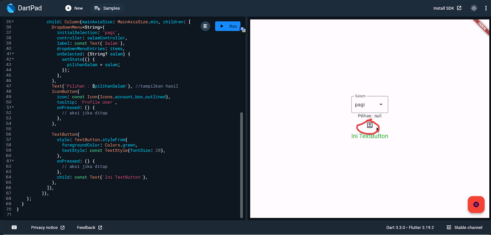

#### ElevatedButton

```dart
ElevatedButton(
  onPressed: () {
    // Add your onPressed callback here
  },
  child: Text('Press me'),
)
```

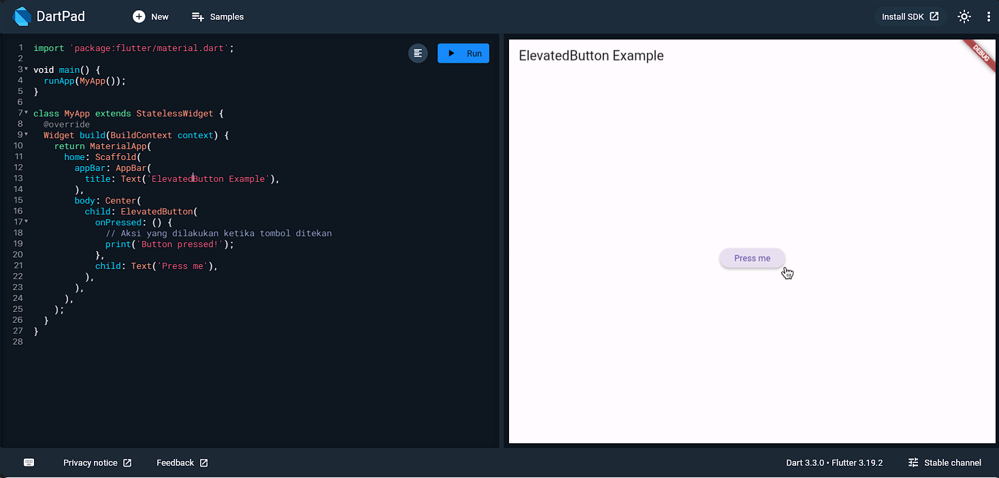

#### TextButton

```dart
TextButton(
  onPressed: () {
    // Add your onPressed callback here
  },
  child: Text('Press me'),
)
```

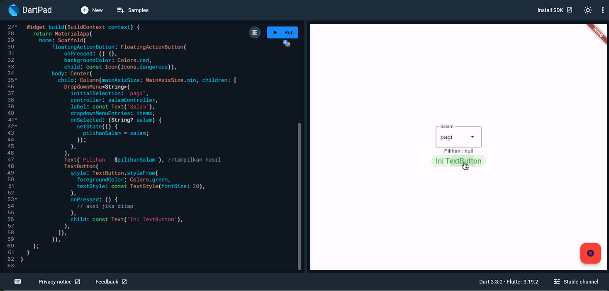

#### SegmentedButton

```dart
SegmentedButton(
  children: [
    SegmentedButtonTile(
      child: Text('Option 1'),
    ),
    SegmentedButtonTile(
      child: Text('Option 2'),
    ),
    SegmentedButtonTile(
      child: Text('Option 3'),
    ),
  ],
  onValueChanged: (value) {
    // Add your onValueChanged callback here
  },
)
```

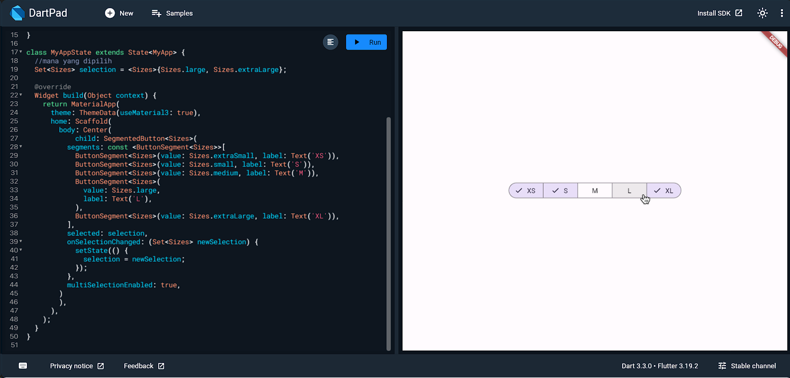

#### PopUpMenuButton

```dart
  PopupMenuButton<String>(
    onSelected: (value) {
      // Add your onSelected callback here
    },
    itemBuilder: (BuildContext context) => [
      PopupMenuItem(value: 'Option 1', child: Text('Option 1')),
      PopupMenuItem(value: 'Option 2', child: Text('Option 2')),
      PopupMenuItem(value: 'Option 3', child: Text('Option 3')),
    ],
  )
```

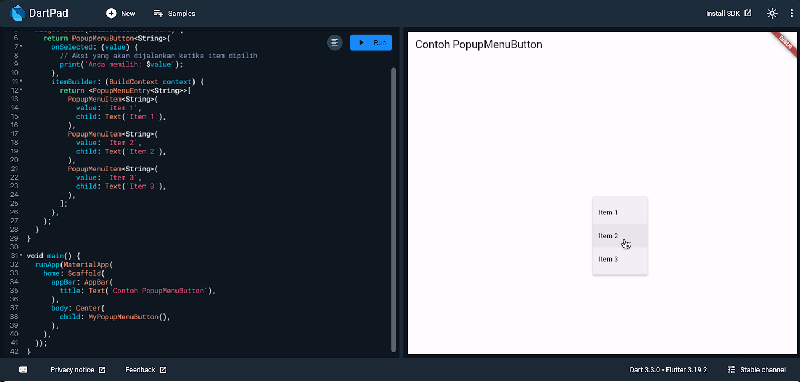

#### CupertinoButton

```dart
CupertinoButton(
  onPressed: () {
    // Add your onPressed callback here
  },
  child: Text('Press me'),
)
```

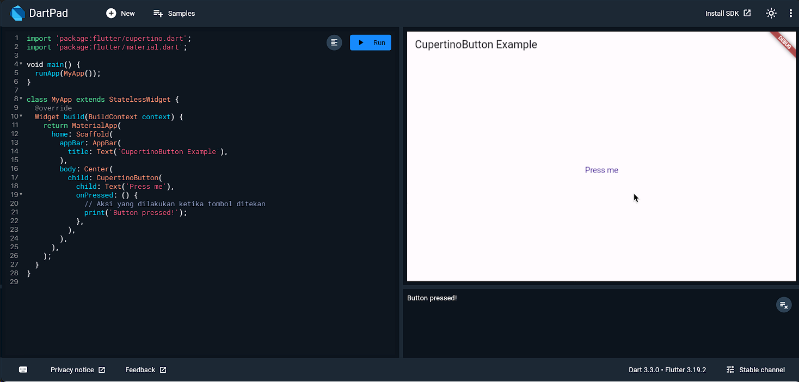

## 4.9 - 🤏🏻 Selection Widgets

Consist of checkboxes, radio buttons, filterChips ,switches, and sliders.

### Checkbox

```dart
Checkbox(
  value: isChecked,
  onChanged: (value) {
    setState(() {
      isChecked = value;
    });
  },
)
```

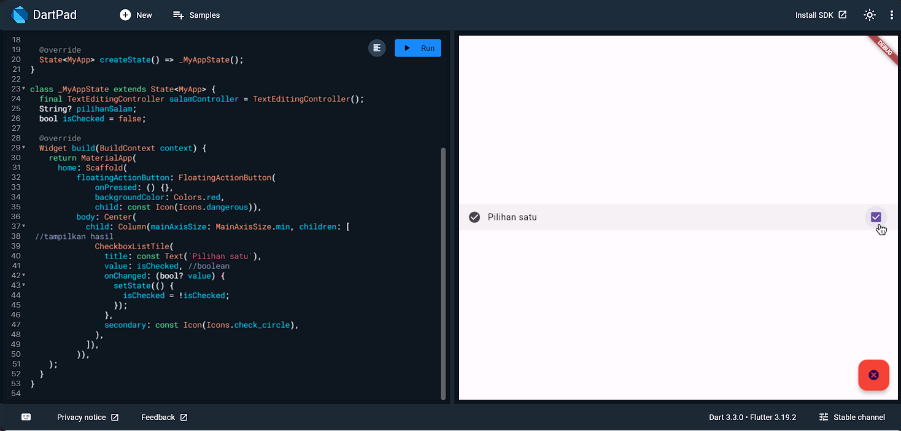

### FilterChips

```dart
FilterChip(
  label: Text('Filter 1'),
  selected: isSelected,
  onSelected: (value) {
    setState(() {
      isSelected = value;
    });
  },
)
```

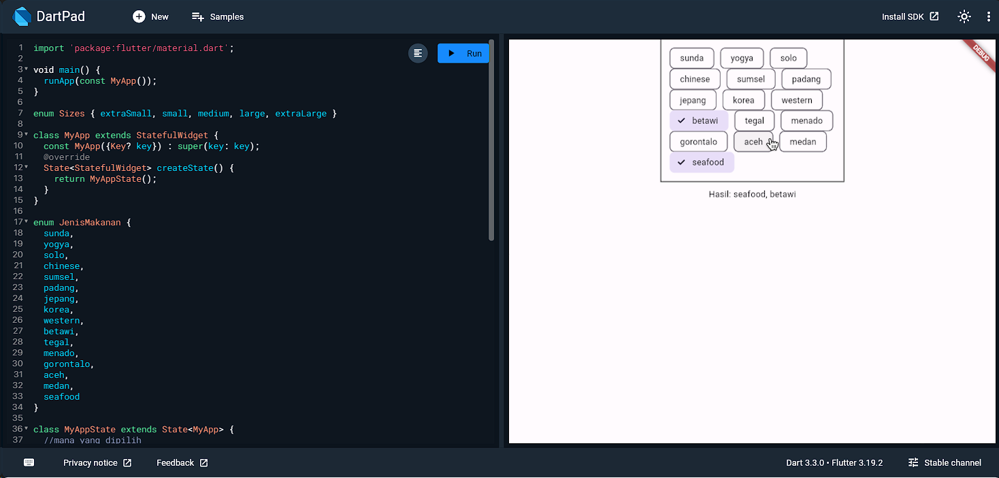

### Radio

```dart
Radio(
  value: selectedValue,
  groupValue: groupValue,
  onChanged: (value) {
    setState(() {
      selectedValue = value;
    });
  },
)
```

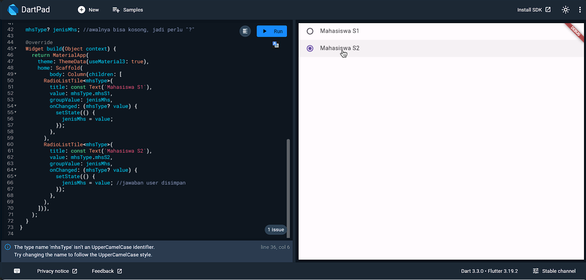

### Switch

```dart
Switch(
  value: isOn,
  onChanged: (value) {
    setState(() {
      isOn = value;
    });
  },
)
```

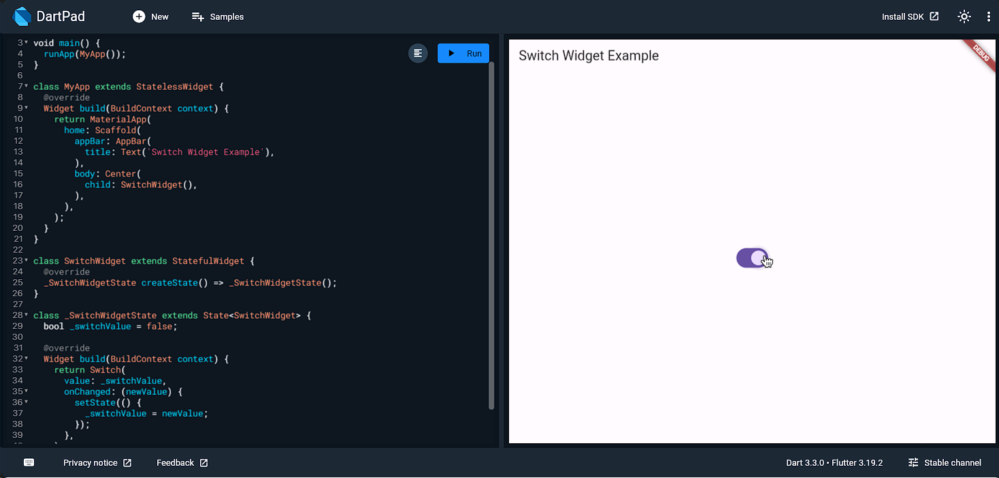

### Sliders

```dart
Slider(
  value: _sliderValue,
  min: 0.0,
  max: 100.0,
  onChanged: (newValue) {
    setState(() {
      _sliderValue = newValue;
    });
  },
)
```

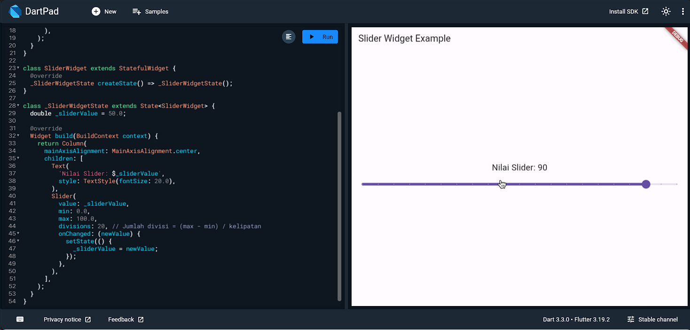

## 4.10 - ❌ Form Validator

Form Validator is used to validate user input in a form. It is used to ensure that the data entered by the user is valid and meets the required criteria.

```dart
Form(
  key: _formKey,
  child: Column(
    children: [
      TextFormField(
        validator: (value) {
          if (value.isEmpty) {
            return 'Please enter some text';
          }
          return null;
        },
      ),
      ElevatedButton(
        onPressed: () {
          if (_formKey.currentState.validate()) {
            // Process the form data
          }
        },
        child: Text('Submit'),
      ),
    ],
  ),
)
```

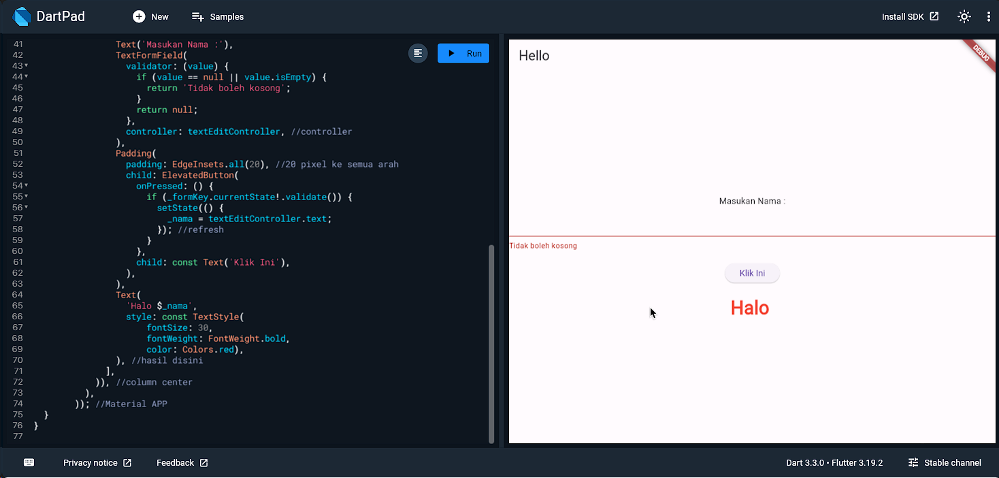

## 4.11 - ℹ️ Snack Bar

Snack bar is a lightweight message that is displayed at the bottom of the screen. It is used to provide feedback to the user, such as a confirmation message or an error message.

```dart
Scaffold(
  body: Center(
    child: ElevatedButton(
      onPressed: () {
        ScaffoldMessenger.of(context).showSnackBar(
          SnackBar(
            content: Text('Hello, World!'),
          ),
        );
      },
      child: Text('Show Snack Bar'),
    ),
  ),
)
```

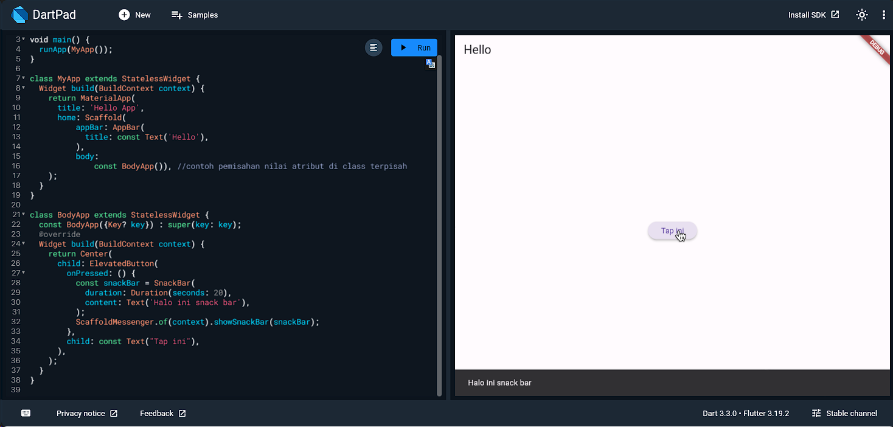

## 4.12 - ⚠️ Alert Dialog

Alert dialog is a modal dialog that is used to display important information to the user. It is often used to confirm an action, such as deleting a file or logging out of an account.

```dart
ElevatedButton(
  onPressed: () {
    showDialog(
      context: context,
      builder: (context) {
        return AlertDialog(
          title: Text('Alert'),
          content: Text('Are you sure you want to delete this item?'),
          actions: [
            TextButton(
              onPressed: () {
                Navigator.of(context).pop();
              },
              child: Text('Cancel'),
            ),
            TextButton(
              onPressed: () {
                // Delete the item
                Navigator.of(context).pop();
              },
              child: Text('Delete'),
            ),
          ],
        );
      },
    );
  },
  child: Text('Show Alert Dialog'),
)
```

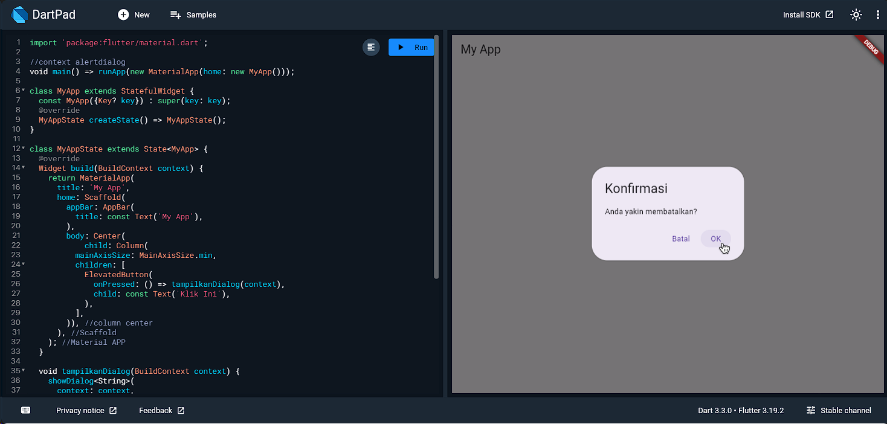

## 4.13 - 💪🏻 Practice Sample

### 1. Create an app that accepts the length and width of a rectangle, then displays the area and perimeter of the rectangle. and perimeter of the rectangle.

> [!TIP] Use int.parse(string) or double.parse(string) to convert string to integer or double.

[1. Rectangle Area and Perimeter](../04-widget/widget_practice/lib/1-areas-circumference.dart)

### 2. Styling the app to your liking

[2. Rectangle Area and Perimeter with Styling](../04-widget/widget_practice/lib/2-padding-styling.dart)

### 3. "Why is `pilihanSalamOut` used in the text instead of `pilihanSalam`?" on [dropdown-list.dart](../04-widget/practical_code/lib/6-dropdown.dart)

Because the `pilihanSalamOut` variable is used to store the value of the option selected by the user from the dropdown menu. The value of `pilihanSalamOut` option is then used to display the selected greeting along with the name entered by the user.

The `pilihanSalamOut` variable is filled with the value of the `pilihanSalam` variable every time the user selects a new option from the dropdown menu. This is done so that the value of `pilihanSalamOut` can change according to the new option, so that later this value can be displayed along with the name entered by the user.

Thus, using the `pilihanSalamOut` variable allows the application to store and display exactly the greeting selected by the user.

### 4.a Create an app that accepts data input from College Students with various Widget

```markdown
nama -> text
gender -> radio button
sudah bekerja -> switch
tinggi badan -> slider
makanan favorit -> checkbox
pekerjaan orang tua -> dropDownMenu
provinsi asal -> dropdownbutton
```

[4.a College Student Form](../04-widget/widget_practice/lib/4.1-input-college.dart)

### 4.b Add form validation for name and provincial origin

[4.b College Student Form with Form Validator](../04-widget/widget_practice/lib/4.2-input-validator.dart)

### 5. Add alert dialog for confirmation and snack bar for input user

[5. College Student Form with alert dialog](../04-widget/widget_practice/lib/5-input-alert-dialog-snack-bar.dart)

## 4.14 - 🪶 To-do

beberapa hal yang harus dipelajari lebih lanjut, karena waktu yang tersedia cukup sedikit waktu di kelas.

### SafeArea

### TextSpan

### Positioned

### Flexible

### isExpanded (DropDown)

### SingleChildScrollView

### Carousel

### with (keyword seperti interface)

### passing data antar widget

### Bottomsheet

### Expansion Panel

### CircleAvatar, Divider
