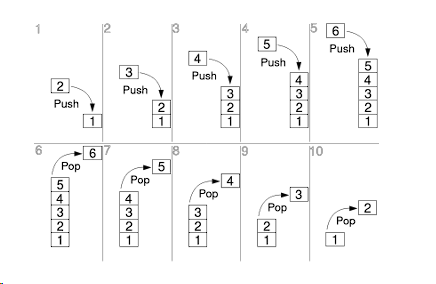
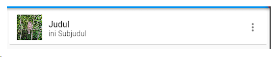
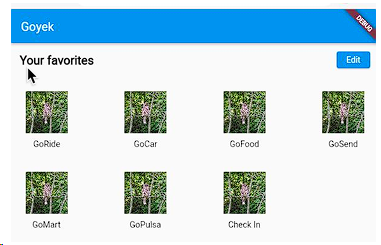
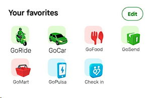
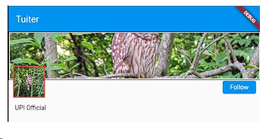
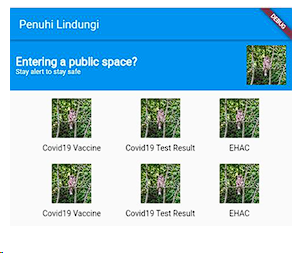
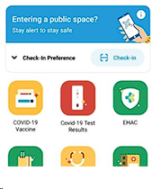
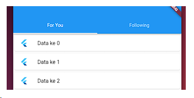
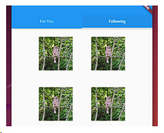

# 🖼️🚀 UI & Routing part 2

In this week we'll talk about full screen dialog, listview, layout, navigation widget, appbar, routing, and notifications. We'll also do some practice to make sure we understand the material.

## 🔗 Quick Link

- [🔢 Praktikum](practical_ui_routing_2/lib/)
- [🏃‍♀️ Practice](question_practice_ui_routing_2/lib/)

---

<!-- TOC -->

- [🔗 Quick Link](#-quick-link)
- [5.1 -❗Full Screen Dialog](#51--full-screen-dialog)
- [5.2 - 🖼️ ListView](#52---️-listview)
  - [ListView Builder()](#listview-builder)
  - [Tap Handling in ListView](#tap-handling-in-listview)
- [5.3 - 🔳 Layout](#53----layout)
  - [Container](#container)
  - [Align](#align)
  - [Wrap](#wrap)
  - [Row and Column](#row-and-column)
  - [Expanded](#expanded)
  - [MinAxisAlignment and MainAxisAlignment](#minaxisalignment-and-mainaxisalignment)
  - [Stack](#stack)
  - [GridView](#gridview)
- [5.4 - 🚀 Navigation Widget](#54----navigation-widget)
  - [Tab](#tab)
  - [Bottom Navigation Bar](#bottom-navigation-bar)
  - [Badge](#badge)
  - [Drawer](#drawer)
- [5.5 - 🚧 AppBar](#55----appbar)
- [5.6 - 🛣️ Routing](#56---️-routing)
  - [Navigator 1.0](#navigator-10)
  - [Passing Parameter](#passing-parameter)
  - [Getting Result from Screen](#getting-result-from-screen)
  - [Named Route](#named-route)
- [5.7 - 🔔 Notifications](#57----notifications)
  - [Local Notifications](#local-notifications)
  - [Push Notifications](#push-notifications)
- [5.8 - 🔍 Reference](#58----reference)
- [5.9 - 🏃‍♀️ Practice](#59---️-practice)
<!-- /TOC -->

---

## 5.1 -❗Full Screen Dialog

Full screen dialog is a dialog that covers the entire screen. It is used to create a new page or screen in the app. To create a full screen dialog, we can use `showDialog` method and set `fullScreenDialog` to `true`.

```dart
showDialog<void>(
  context: context,
  builder: (BuildContext context) => Dialog.fullscreen(
    child: Center(
        child: Column(
      mainAxisSize: MainAxisSize.min,
      children: [
        const Padding(
            padding: EdgeInsets.all(20), child: Text("Dialog Fullscreen")),
        ElevatedButton(
          onPressed: () => Navigator.pop(context, 'Cancel'),
          child: const Text('Tutup'),
        ),
      ],
    )),
  ),
);

```

## 5.2 - 🖼️ ListView

`ListView` puts information in the form of scrollable rows. This widget is important for mobile applications because it can display information vertically and can be scrolled.

```dart
ListView(padding: const EdgeInsets.all(20), children: const [
    Text('Hello World 1a'),
    Divider(
      height: 30,
    ),
    Text('Hello World 1b'),
    Divider(
      height: 30,
    ),
    Text('Hello World 1c'),
  ])
```

- **_With Container_**

```dart
ListView(padding: EdgeInsets.all(20), children: [
  Container(
      decoration: BoxDecoration(border: Border.all()),
      padding: EdgeInsets.all(14),
      child: Text('Hello World 1a')),
  Container(
      decoration: BoxDecoration(border: Border.all()),
      padding: EdgeInsets.all(14),
      child: Text('Hello World xxx')),
]),
```

### ListView Builder()

If we want to build bulk of `ListView` items, the previous method is not efficient. We can use `ListView.builder` to build the list items dynamically.

```dart
class MyAppState extends State<MyApp> {
  List<String> data = []; //data untuk listview

  @override
  void initState() {
    super.initState();
    // isi data listview
    for (int i = 0; i < 20; i++) {
      data.add("Data ke $i ");
    }
  }

  @override
  Widget build(BuildContext context) {
    return MaterialApp(
      title: 'Welcome to Flutter',
      home: Scaffold(
        appBar: AppBar(
          title: const Text('Welcome to Flutter'),
        ),
        body: Center(
          //gunakan listview builder
          child: ListView.builder(
            itemCount: data.length,
            itemBuilder: (context, index) {
              return Container(
                decoration: BoxDecoration(border: Border.all()),
                padding: const EdgeInsets.all(14),
                child: Text(data[index]),
              );
            },
          ),
        ),
      ),
    );
  }
}
```

### Tap Handling in ListView

```dart
child: ListView.builder(
  itemCount: data.length,
  itemBuilder: (context, index) {
    return Card(
        child: ListTile(
      onTap: () {
        ScaffoldMessenger.of(context).showSnackBar(SnackBar(
          duration: Duration(seconds: 1),
          content: Text('Halo ${data[index]}'),
        ));
      },
      title: Text(data[index]),
    ));
  },
),
```

## 5.3 - 🔳 Layout

Some widgets like Button don't have position information. Flutter provides widget layouts that can be used to adjust the position, size, style and position management of child widgets. Here we will discuss some widgets related to position and layout.

### Container

Containers play an important role in layout. Containers can be used to add padding, borders, margins, widget position and size. Containers have child, heigh, width, padding, margin, decoration attributes. Decoration contains background image, background color and border.

```dart
Container(
  margin: EdgeInsets.all(20),
  padding: EdgeInsets.all(20),
  decoration: BoxDecoration(
    color: Colors.blue,
    border: Border.all(),
  ),
  child: Text('Hello World'),
)

// We can use `Container( width:double.infinity,` to make container size filling screen width.
```

> [!NOTE]
> Container vs SizedBox are both similar, Container can adjust shape, padding, margin, decoration, alignment while SizedBox is only size. For whitespace, it is recommended to use SizedBox because it is lighter than Container.

### Align

Widget Align can be used to set the alignment of a single widget. If we have previously used Center, Align provides several other options such as bottomLeft, bottomRight, topCenter etc.

```dart
Align(
  alignment: Alignment.center,
  child: container(
    decoration: BoxDecoration(
      color: Colors.blue,
      border: Border.all(),
    ),
    child: Text('Hello World'),
  ),
)
```

### Wrap

Wrap is a widget that places its children widget horizontally, but if it is not enough it will be placed on the next row.

```dart
Container(
  width: 200,
  child: const Wrap(
    spacing: 10,
    children: [
      Text("satusatustu"),
      Text("dudududuaua"),
      Text("tigasigaga"),
      Text("empatempat"),
      Text("lialima"),
      Text("enamenam"),
      Text("tujuh"),
      Text("delapan"),
      Text("sembilan"),
    ],
  ),
),
```

### Row and Column

Row and Column are the most commonly used widgets for layouts. This widget has a children attribute that contains widgets that will be under Row or Column. In the previous example we used the Column widget, here's the code for the Row example:

```dart
body: Center(
          child: Row(mainAxisAlignment: MainAxisAlignment.center, children: [
            Container(
                decoration: BoxDecoration(border: Border.all()),
                padding: EdgeInsets.all(14),
                child: Column(
                    mainAxisAlignment: MainAxisAlignment.center,
                    children: [
                      Container(
                          decoration: BoxDecoration(border: Border.all()),
                          padding: EdgeInsets.all(14),
                          child: Text('Hello World 1a')),
                      Container(
                          decoration: BoxDecoration(border: Border.all()),
                          padding: EdgeInsets.all(14),
                          child: Text('Hello World 1b')),
                    ])),
            Container(
                decoration: BoxDecoration(border: Border.all()),
                padding: EdgeInsets.all(14),
                child: Column(
                    mainAxisAlignment: MainAxisAlignment.center,
                    children: [
                      Container(
                          decoration: BoxDecoration(border: Border.all()),
                          padding: EdgeInsets.all(14),
                          child: Text('Hello World 2a')),
                      Container(
                          decoration: BoxDecoration(border: Border.all()),
                          padding: EdgeInsets.all(14),
                          child: Text('Hello World 2b')),
                    ])),
          ]),
        ),
```

### Expanded

Expanded widgets are used so that widgets in Row and Column can fully fill their parents.

```dart
child: Column(
  mainAxisAlignment: MainAxisAlignment.center,
  children: [
    Expanded(
      child: Container(
          decoration: BoxDecoration(border: Border.all()),
          padding: const EdgeInsets.all(14),
          child: Text('Hello World 1a')),
    ),
    Container(
        decoration: BoxDecoration(border: Border.all()),
        padding: const EdgeInsets.all(14),
        child: const Text('Hello World 1b')),
  ]),
```

### MinAxisAlignment and MainAxisAlignment

MainAxisAlignment is used to set the alignment of the main axis, while CrossAxisAlignment is used to set the alignment of the cross axis. The main axis is the axis that is used by Row and Column, while the cross axis is the axis that is perpendicular to the main axis.

```dart
Row(mainAxisAlignment: MainAxisAlignment.spaceEvenly, children: [
  Container(
      decoration: BoxDecoration(border: Border.all()),
      padding: EdgeInsets.all(14),
      child: Text('Hello World 1!')),
  Container(
      decoration: BoxDecoration(border: Border.all()),
      padding: EdgeInsets.all(14),
      child: Text('Hello World 2!')),
  Container(
      decoration: BoxDecoration(border: Border.all()),
      padding: EdgeInsets.all(14),
      child: Text('Hello World 3!')),
]),
```

### Stack

Stack arranges the widgets below it in layers, so widgets can be arranged stacked.

```dart
body: Center(
          child: Stack(children: [
            Container(
                width: 100,
                height: 100,
                decoration: BoxDecoration(border: Border.all()),
                padding: EdgeInsets.all(14),
                child: Text('Hello World 1a')),
            Container(
                width: 200,
                decoration: BoxDecoration(border: Border.all()),
                padding: EdgeInsets.all(14),
                child: Text('Hello World xxx')),
          ]),
        ),
```

### GridView

GridView is a widget that can be used to display widgets in a grid. GridView has a gridDelegate attribute that can be used to set the layout of the grid. Here's an example of using GridView:

```dart
body: Center(
          child: GridView(
              padding: const EdgeInsets.all(20),
              gridDelegate: const SliverGridDelegateWithFixedCrossAxisCount(
                crossAxisCount: 2,
              ),
              children: [
                Container(
                    decoration: BoxDecoration(border: Border.all()),
                    padding: EdgeInsets.all(14),
                    child: Text('Hello World 1a')),
                Container(
                    decoration: BoxDecoration(border: Border.all()),
                    padding: EdgeInsets.all(14),
                    child: Text('Hello World 1b')),
                Container(
                    decoration: BoxDecoration(border: Border.all()),
                    padding: EdgeInsets.all(14),
                    child: Text('Hello World 1c')),
                Container(
                    decoration: BoxDecoration(border: Border.all()),
                    padding: EdgeInsets.all(14),
                    child: Text('Hello World 1d')),
              ]),
        ),
```

## 5.4 - 🚀 Navigation Widget

### Tab

Tab is a widget that can be used to create a tab layout. Tab has a tabs attribute that contains a list of Tab widgets. Here's an example of using Tab:

```dart
  @override
  Widget build(BuildContext context) {
    return MaterialApp(
      home: DefaultTabController(
        length: 2,
        child: Scaffold(
          appBar: AppBar(
              title: const Text('Fakultas'),
              bottom: const TabBar(tabs: [
                Tab(icon: Icon(Icons.directions_bike), text: "Sepeda"),
                Tab(icon: Icon(Icons.directions_boat), text: "Kapal")
              ])),
          body: const TabBarView(
            children: [
              Center(child: Text("isi tab 1")),
              Center(child: Text("isi tab 2"))
            ],
          ),
        ),
      ),
    );
  }
```

### Bottom Navigation Bar

BottomNavigationBar is a widget that can be used to create a bottom navigation bar. BottomNavigationBar has an items attribute that contains a list of BottomNavigationBarItem widgets. Here's an example of using BottomNavigationBar:

```dart
import 'package:flutter/material.dart';

void main() {
  runApp(const MyApp());
}

class MyApp extends StatefulWidget {
  const MyApp({Key? key}) : super(key: key);
  @override
  MyAppState createState() {
    return MyAppState();
  }
}

class MyAppState extends State<MyApp> {
  int idx = 0; //index yang aktif

  static const List<Center> halaman = [
    Center(child: Text("satu")),
    Center(child: Text("dua"))
  ];

  void onItemTap(int index) {
    setState(() {
      idx = index;
    });
  }

  @override
  Widget build(BuildContext context) {
    return MaterialApp(
        home: Scaffold(
      appBar: AppBar(title: const Text("Bottom Nav")),
      body: halaman[idx],
      bottomNavigationBar: BottomNavigationBar(
          currentIndex: idx,
          selectedItemColor: Colors.red,
          onTap: onItemTap,
          items: const <BottomNavigationBarItem>[
            BottomNavigationBarItem(icon: Icon(Icons.home), label: 'Home'),
            BottomNavigationBarItem(icon: Icon(Icons.school), label: " School"),
          ]),
    ));
  }
}
```

### Badge

Badge is a widget that can be used to create a badge. Badge has a child attribute that contains a widget that will be given a badge. Here's an example of using Badge:

```dart
BottomNavigationBarItem(
                icon: Badge(label: Text("2"), child: Icon(Icons.school)),
                label: " School"),
```

### Drawer

Drawer is a widget that can be used to create a drawer. Drawer has a child attribute that contains a widget that will be given a drawer. Here's an example of using Drawer:

```dart
class HomePageState extends State<HomePage> {
  int idx = 0;

  static const List<Center> halaman = [
    Center(child: Text("satu")),
    Center(child: Text("dua")),
    Center(child: Text("tiga")),
  ];

  void gantiItem(int index) {
    setState(() {
      idx = index;
    });
  }

  @override
  Widget build(BuildContext context) {
    return Scaffold(
        appBar: AppBar(title: const Text("Test Drawer.")),
        body: halaman[idx],
        drawer: Drawer(
            child: ListView(
          children: [
            const DrawerHeader(child: Text("Ini Header")),
            ListTile(
                title: const Text("item1"),
                onTap: () {
                  gantiItem(0);
                }),
            ListTile(
                title: const Text("item2"),
                onTap: () {
                  gantiItem(1);
                }),
            ListTile(
                title: const Text("item3"),
                onTap: () {
                  gantiItem(2);
                })
          ],
        )));
  }
}
```

## 5.5 - 🚧 AppBar

AppBar is a widget that can be used to create an app bar. AppBar has a title attribute that contains a widget that will be used as the title of the app bar. Here's an example of using AppBar:

```dart
home: Scaffold(
        appBar: AppBar(
          leading: const FlutterLogo(),
          backgroundColor: Colors.blueGrey,
          title: const Text('My App'),
          actions: <Widget>[
            IconButton(
              icon: const Icon(Icons.account_circle_rounded),
              onPressed: () {
                // Aksi ketika ikon akun ditekan
              },
            ),
            IconButton(
              icon: const Icon(Icons.settings),
              onPressed: () {
                // Aksi ketika ikon pengaturan ditekan
              },
            ),
          ],
        ),
        body: const Center(
          child: Text('Ini adalah konten utama'),
        ),
      ),
```

## 5.6 - 🛣️ Routing

Mobile apps generally consist of several screens. Flutter calls the process of moving between screens a `route` handled by the Navigator widget.

Widget Navigator manages navigation history (can return to the initial screen when the back button is tapped) through the navigation stack. This widget also handles data exchange between screens. There are three classes involved: Navigator, Overlay and Route.

There are two types of `Navigators`. First, `Navigator 1.0` is more appropriate for mobile apps and `Navigator 2.0` supports deep links. Deep links are used in web applications when a user signs in to the application via a URL link (_e.g. a direct link to a product)_. Even if we don't go through the first page, we still want the navigation functions to keep running. `Navigator 2.0` is more complicated than `Navigator 1.0`

### Navigator 1.0

```dart
import 'package:flutter/material.dart';

class LayarKedua extends StatelessWidget {
  @override
  Widget build(BuildContext context) {
    return Scaffold(
      appBar: AppBar(
        title: const Text('Screen 2'),
      ),
      body: Center(child: Text("Ini screen kedua, tap icon back di app bar")),
    );
  }
}

void main() {
  runApp(const MyApp());
}

class MyApp extends StatelessWidget {
  const MyApp({Key? key}) : super(key: key);

  @override
  Widget build(BuildContext context) {
    return MaterialApp(title: 'Test Route', home: MyHome());
  }
}

//perlu  dipisah karena Navigator perlu punya parent Material App
class MyHome extends StatelessWidget {
  @override
  Widget build(BuildContext context) {
    return Scaffold(
      appBar: AppBar(
        title: const Text('Test Route'),
      ),
      body: Center(
        child: ElevatedButton(
            child: Text('Ke screen Kedua'),
            onPressed: () {
              Navigator.of(context).push(MaterialPageRoute(builder: (context) {
                return LayarKedua();
              }));
            }),
      ),
    );
  }
}
```

> [!NOTE]
> To increase modularity, the Second Screen class can be split into other files, for example secondscreen.dart and then used via import on the first screen. import 'layardua.dart';

The navigator uses push and pop because it manages the screen in a stack. The following figure shows the push and pop mechanism inside the stack (LIFO: Last in First Out). That's why when the pop() function is called, the active screen is "discarded" and returns to the previous screen.



### Passing Parameter

We can send data to the screen that will be displayed using the screen constructor.

```dart
import 'package:flutter/material.dart';

class LayarKedua extends StatelessWidget {
  const LayarKedua({Key? key, required this.pesan}) : super(key: key);
  final String pesan;

  @override
  Widget build(BuildContext context) {
    return Scaffold(
        appBar: AppBar(
          title: const Text('Screen 2'),
        ),
        body: Center(
            child: ElevatedButton(
          child: Text("Ini screen kedua, ada pesan: $pesan"),
          onPressed: () {
            Navigator.of(context).pop();
          },
        )));
  }
}

void main() {
  runApp(const MyApp());
}

class MyApp extends StatelessWidget {
  const MyApp({Key? key}) : super(key: key);

  @override
  Widget build(BuildContext context) {
    return const MaterialApp(title: 'Test Route', home: MyHome());
  }
}

//perlu  dipisah karena Navigator perlu punya parent Material App
class MyHome extends StatelessWidget {
  const MyHome({Key? key}) : super(key: key);

  @override
  Widget build(BuildContext context) {
    return Scaffold(
      appBar: AppBar(
        title: const Text('Test Route'),
      ),
      body: Center(
        child: ElevatedButton(
          child: const Text('Ke screen Kedua'),
          onPressed: () {
            // ini adalah passing parameter
            Navigator.of(context).push(MaterialPageRoute(builder: (context) {
              return const LayarKedua(pesan: "haloo ini pesan dari screen 1");
            }));
          }
        ),
      ),
    );
  }
}
```

### Getting Result from Screen

If previously we sent data, now after calling a screen we expect data from that screen. Data can be sent via the `pop()` method.

```dart
import 'package:flutter/material.dart';

class LayarKedua extends StatelessWidget {
  const LayarKedua({Key? key, required this.pesan}) : super(key: key);
  final String pesan;

  @override
  Widget build(BuildContext context) {
    return Scaffold(
        appBar: AppBar(
          title: const Text('Screen 2'),
        ),
        body: Center(
            child: ElevatedButton(
          child: Text("Ini screen kedua, ada pesan: $pesan"),
          onPressed: () {
            Navigator.of(context).pop("ini data dari screen 2");
          },
        )));
  }
}

void main() {
  runApp(const MyApp());
}

class MyApp extends StatelessWidget {
  const MyApp({Key? key}) : super(key: key);

  @override
  Widget build(BuildContext context) {
    return const MaterialApp(title: 'Test Route', home: MyHome());
  }
}

//perlu  dipisah karena Navigator perlu punya parent Material App
class MyHome extends StatefulWidget {
  const MyHome({Key? key}) : super(key: key);

  @override
  State<StatefulWidget> createState() {
    return MyHomeState();
  }
}

class MyHomeState extends State<MyHome> {
  String _hasil = "";

  set hasil(String hasil) {
    _hasil = hasil;
    setState(() {});
  }

  @override
  Widget build(BuildContext context) {
    return Scaffold(
      appBar: AppBar(
        title: const Text('Test Route'),
      ),
      body: Center(
          child: Column(mainAxisAlignment: MainAxisAlignment.center, children: [
        ElevatedButton(
            child: const Text('Ke screen Kedua'),
            // get result from screen
            onPressed: () async {
              hasil = await Navigator.of(context)
                  .push(MaterialPageRoute(builder: (context) {
                return const LayarKedua(pesan: "haloo ini pesan dari screen 1");
              }));
            }),
        Text(" Hasil: $_hasil")
      ])),
    );
  }
}
```

### Named Route

In the previous example, we used the `MaterialPageRoute` class to navigate to the next screen. This method is not recommended for large applications because it is difficult to maintain. We can use the `Named Route` method to make it easier to maintain.

```dart
class MyApp extends StatelessWidget {
  const MyApp({Key? key}) : super(key: key);

  @override
  Widget build(BuildContext context) {
    return MaterialApp(
      title: 'Test Route',
      // delete home atributes
      routes: {
        '/': (context) => const MyHome(),
        '/layar2': (context) => const LayarKedua()
      },
    );
  }
}
```

and then we can call the screen using the `Navigator.pushNamed` method.

```dart
onPressed: () {
  Navigator.of(context).pushNamed('/layar2');
},
```

## 5.7 - 🔔 Notifications

Notifications are brief information for users about an event. Notifications can be used as reminders, information from other users or ask users to open the app to perform an action. Flutter has two types of notifications. Local notifications are sourced from the application, while push notifications are sourced from the server that is sent even though the application is inactive.

### Local Notifications

https://pub.dev/packages/flutter_local_notifications

```yaml
dependencies:
  flutter_local_notifications: ^14.0.0
```

```dart
import 'package:flutter/material.dart';
import 'package:flutter_local_notifications/flutter_local_notifications.dart';

void main() {
  runApp(const MyApp());
}

class MyApp extends StatelessWidget {
  const MyApp({Key? key}) : super(key: key);

  @override
  Widget build(BuildContext context) {
    return MaterialApp(
      title: 'Flutter Demo',
      theme: ThemeData(
        primarySwatch: Colors.blue,
      ),
      home: const MyHomePage(),
    );
  }
}

class MyHomePage extends StatefulWidget {
  const MyHomePage({Key? key}) : super(key: key);

  @override
  State<MyHomePage> createState() => _MyHomePageState();
}

class _MyHomePage
```

### Push Notifications

Push Notification (information pushed to the user) is one of the advantages of mobile applications. Push notifications happen when the app is not in use (outside the app's UI).

One implementation of notifications, especially on Android, is using Firebase Cloud Messaging, which allows us to send notifications even when the app is inactive.

https://pub.dev/packages/firebase_messaging

## 5.8 - 🔍 Reference

1. Alessandria, Simone. Flutter Projects: A Practical, Project-based Guide to Building Real-world Cross-platform Mobile Applications and Games. Packt Publishing, 2020.

2. Bailey, Thomas. Flutter for Beginners: An introductory guide to building cross-platform mobile applications with Flutter 2.5 and Dart, 2nd Edition

3. https://api.flutter.dev

## 5.9 - 🏃‍♀️ Practice

1.  Use Cards to display photos, names and hobbies (bottom image) using `Listview.Builder`. Titles become names, subtitles are hobbies. Names and hobbies are stored in the form of `Map<String, String>`

    

2.  Create gridView implementation

    

    as a bonus, make them look like this

    

3.  Recreate twitter profile page  
    

    > [!TIP]
    > Use the BoxFit attribute in the image and width:double.infinity for the container

    Make them as much as this

    

4.  Recrate PeduliLindungi App

    

    Make them like this

    

5.  Create Tab Navigation like this:

    

    and the Following tab look like this:

    
